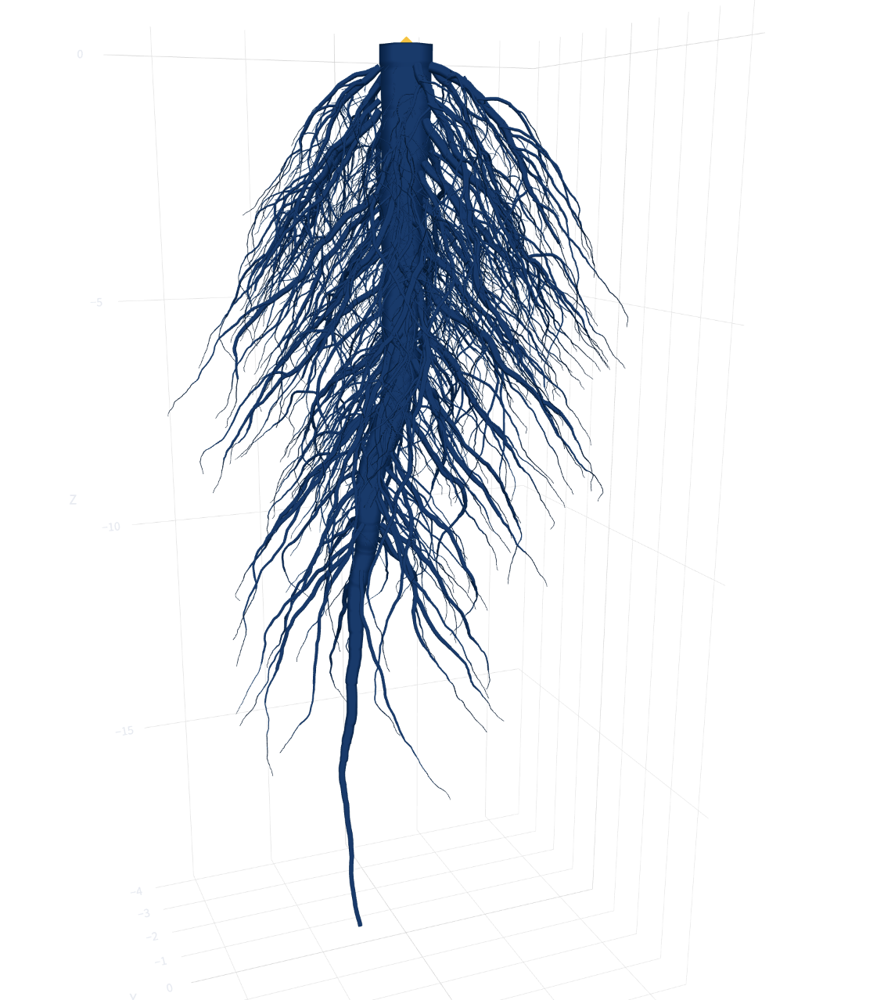

# Luis Fernando Angulo

**University of Arizona**

Computational researcher interested in using statistics, machine learning, and scientific computing to study complex biological and biomedical systems.

 

## About Me

- 🎓 Senior at the **University of Arizona** studying **Statistics & Data Science**, with minors in **Computer Science** and **Microbiology**.
- 🔬 Computational researcher developing stochastic models of **3D root architecture** and analyzing large-scale simulations.
- 🧬 Interested in **statistical machine learning, survival analysis, biomedical data, scientific computing, and computational biology**.
- 💻 I enjoy building projects that combine **mathematics, statistics, programming, and biology**.

 

## Featured Research

### 🌱 3D Root Architecture Simulation

**Computational Plant Science Laboratory · University of Arizona**

Developing a stochastic framework for generating and analyzing three-dimensional root architectures using local coordinate systems, quaternion-based transformations, branching, self-avoidance, and large-scale Monte Carlo simulation.

  

<table>
<tr>
<td align="center">
<strong>4.9M+</strong> 
Monte Carlo Simulations
</td>
<td align="center">
<strong>24,503</strong> 
Parameter Configurations
</td>
<td align="center">
<strong>130+</strong> 
Statistics per Simulation
</td>
</tr>
</table>

**Tools:** `Python` · `NumPy` · `Scientific Computing` · `Monte Carlo` · `HPC` · `Git`

[**3D Root Architecture Simulator →**](https://github.com/luisferangulob/3d-root-architecture-simulator)  
[**Interactive Root Visualizer →**](https://github.com/luisferangulob/root-architecture-visualizer)

 

## Selected Projects

### 📊 Root Architecture Visualizer

Interactive application for exploring and comparing simulated three-dimensional root architectures and their quantitative characteristics.

Built to turn simulation outputs into a more intuitive environment for inspecting root geometry, parameter configurations, and statistical measurements.

**Tools:** `Python` · `Streamlit` · `Data Visualization` · `Scientific Computing`

[**View Repository →**](https://github.com/luisferangulob/root-architecture-visualizer)

 

### 🧬 Glioblastoma Survival Analysis

Analysis of clinical and survival data from **The Cancer Genome Atlas (TCGA)** for patients with glioblastoma.

Cleaned and structured patient-level clinical data to examine survival outcomes, censoring, demographic characteristics, and variables relevant to biomedical prognosis.

**Tools:** `Python` · `pandas` · `Survival Analysis` · `Biomedical Data` · `Data Cleaning`

 

## Technical Skills

### Programming & Data

### Tools & Scientific Computing

### Methods & Domains

<!--
**luisferangulob/luisferangulob** is a ✨ _special_ ✨ repository because its `README.md` (this file) appears on your GitHub profile.

Here are some ideas to get you started:

- 🔭 I’m currently working on ...
- 🌱 I’m currently learning ...
- 👯 I’m looking to collaborate on ...
- 🤔 I’m looking for help with ...
- 💬 Ask me about ...
- 📫 How to reach me: ...
- 😄 Pronouns: ...
- ⚡ Fun fact: ...
-->
